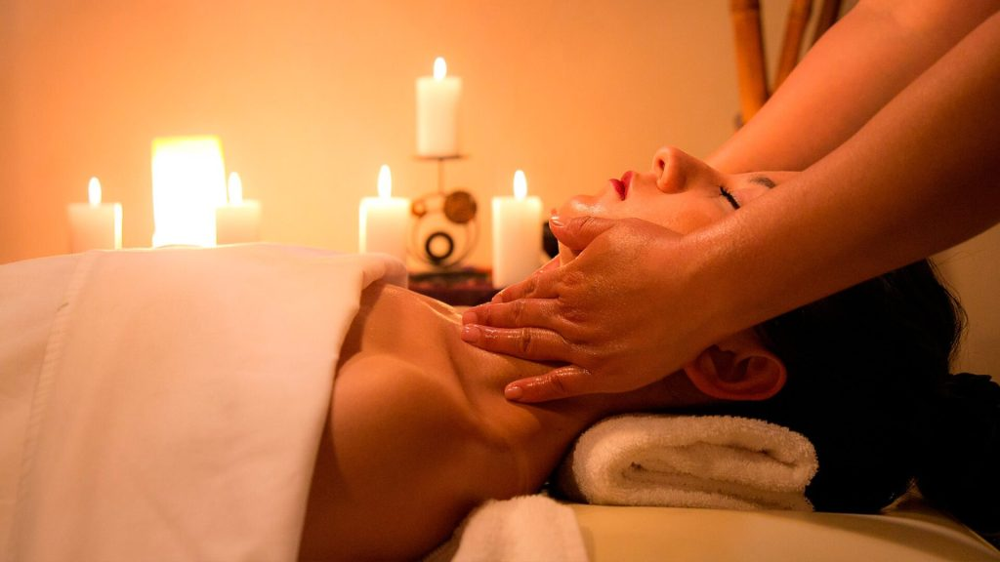

<!DOCTYPE html>
<html lang="pt-BR">
<head>
    <meta charset="UTF-8">
    <meta name="viewport" content="width=device-width, initial-scale=1.0">
    <title>Rose Dourado Estética e Massagens padrão de spa</title>
    <link rel="stylesheet" href="css/styles.css">
    
</head>
<body>
    <header>
        
        <h1>Rose Dourado Estética e Massagens padrão de spa</h1>
        <nav>
            <ul>
                <li id="homeLink" onclick="showSection('home')">Home</li>
                <li id="massagensLink" onclick="showSection('massagens')">Massagens</li>
                <li id="faciaisLink" onclick="showSection('faciais')">Tratamentos Faciais</li>
                <li id="carrinhoLink" onclick="showSection('carrinho')">Carrinho</li>
                <li id="agendamentoLink" onclick="showSection('agendamento')">Agendamento</li>
                <li id="quemSomosLink" onclick="showSection('quemSomos')">Quem Somos</li>
            </ul>
        </nav>
    </header>

    <!-- Seção Home -->
    <section id="home" class="section active">
        <h2>Bem-vindo à Rose Dourado</h2>
        
Experimente o luxo e o relaxamento com nossos serviços de spa e bem-estar.

        

            <button class="servico-btn" onclick="showSection('massagens')">Massagens</button>
            <button class="servico-btn" onclick="showSection('faciais')">Tratamentos Faciais</button>
        

        

            <h3>Nossa História</h3>
            
A Rose Dourado Estética e Massagens padrão de spa nasceu da paixão por promover bem-estar e qualidade de vida. Fundada em 2018, nossa empresa foi criada com o objetivo de oferecer um refúgio de paz e relaxamento para quem busca cuidar de si e renovar suas energias. Desde o início, nosso propósito foi unir técnicas tradicionais com as mais recentes inovações em estética e massagem, sempre com foco no conforto e satisfação dos nossos clientes.
                
                Nosso compromisso com a excelência nos levou a investir constantemente em capacitação, produtos de alta qualidade e tecnologias de ponta. Hoje, contamos com uma equipe de profissionais experientes e apaixonados pelo que fazem, prontos para oferecer um atendimento personalizado e adaptado às necessidades de cada cliente.
                
                Ao longo dos anos, nos tornamos referência em [serviço ou área de especialidade, como “massoterapia terapêutica” ou “estética facial e corporal”] na região, conquistando a confiança de nossos clientes por meio de uma experiência que vai além do serviço: é uma verdadeira jornada de cuidado e bem-estar.

        

    </section>

    <!-- Seção Quem Somos -->
    <section id="quemSomos" class="section">
        <h3>Quem Somos</h3>
        
Na Rose Dourado Estética e Massagens padrão de spa, acreditamos que cuidar do corpo é essencial para manter a mente e o espírito em harmonia. Somos uma clínica de estética e massagem dedicada a oferecer experiências de bem-estar que promovem relaxamento, saúde e autoestima. Nossa equipe é composta por profissionais altamente qualificados e apaixonados por transformar vidas por meio do cuidado pessoal.

        
Trabalhamos com um ambiente acolhedor, técnicas avançadas e produtos de qualidade para proporcionar um atendimento que supere as expectativas de nossos clientes. Nosso compromisso é oferecer um serviço personalizado, respeitando as necessidades e preferências de cada pessoa que chega até nós.

        
Com uma abordagem que une tradição e inovação, buscamos ser mais do que um simples serviço: queremos criar experiências que renovem o corpo, a mente e o espírito de nossos clientes.

        <button onclick="showSection('home')">Voltar ao Home</button>
    </section>

    <!-- Seção Tratamentos Faciais -->
    <section id="faciais" class="section">
        <h3>Tratamentos Faciais</h3>
        <ul>
            <li>Limpeza de Pele Profunda - R$ 100,00 <button onclick="adicionarAoCarrinho('Limpeza de Pele Profunda', 100)">Adicionar ao Carrinho</button></li>
            <li>Hidratação Facial - R$ 80,00 <button onclick="adicionarAoCarrinho('Hidratação Facial', 80)">Adicionar ao Carrinho</button></li>
            <li>Peeling Facial - R$ 120,00 <button onclick="adicionarAoCarrinho('Peeling Facial', 120)">Adicionar ao Carrinho</button></li>
            <li>Máscara de Ouro - R$ 150,00 <button onclick="adicionarAoCarrinho('Máscara de Ouro', 150)">Adicionar ao Carrinho</button></li>
            <li>Tratamento Antiacne - R$ 110,00 <button onclick="adicionarAoCarrinho('Tratamento Antiacne', 110)">Adicionar ao Carrinho</button></li>
            <li>Tratamento para Rejuvenescimento - R$ 180,00 <button onclick="adicionarAoCarrinho('Tratamento para Rejuvenescimento', 180)">Adicionar ao Carrinho</button></li>
            <li>Radiofrequência Facial - R$ 200,00 <button onclick="adicionarAoCarrinho('Radiofrequência Facial', 200)">Adicionar ao Carrinho</button></li>
            <li>Microagulhamento - R$ 250,00 <button onclick="adicionarAoCarrinho('Microagulhamento', 250)">Adicionar ao Carrinho</button></li>
            <li>Peeling de Diamante - R$ 140,00 <button onclick="adicionarAoCarrinho('Peeling de Diamante', 140)">Adicionar ao Carrinho</button></li>
            <li>Tratamento para Clareamento de Manchas - R$ 160,00 <button onclick="adicionarAoCarrinho('Tratamento para Clareamento de Manchas', 160)">Adicionar ao Carrinho</button></li>
            <li>Botox Facial - R$ 300,00 <button onclick="adicionarAoCarrinho('Botox Facial', 300)">Adicionar ao Carrinho</button></li>
            <li>Hidratação com Colágeno - R$ 120,00 <button onclick="adicionarAoCarrinho('Hidratação com Colágeno', 120)">Adicionar ao Carrinho</button></li>
            <li>Peeling de Cristal - R$ 150,00 <button onclick="adicionarAoCarrinho('Peeling de Cristal', 150)">Adicionar ao Carrinho</button></li>
            <li>Máscara de Argila - R$ 90,00 <button onclick="adicionarAoCarrinho('Máscara de Argila', 90)">Adicionar ao Carrinho</button></li>
            <li>Tratamento de Lifting Facial - R$ 220,00 <button onclick="adicionarAoCarrinho('Tratamento de Lifting Facial', 220)">Adicionar ao Carrinho</button></li>
            <li>Revitalização com Vitamina C - R$ 130,00 <button onclick="adicionarAoCarrinho('Revitalização com Vitamina C', 130)">Adicionar ao Carrinho</button></li>
            <li>Tratamento Redutor de Linhas de Expressão - R$ 180,00 <button onclick="adicionarAoCarrinho('Tratamento Redutor de Linhas de Expressão', 180)">Adicionar ao Carrinho</button></li>
            
        </ul>
        <button onclick="showSection('home')">Voltar ao Home</button>
    </section>

    <!-- Seção Massagens -->
    <section id="massagens" class="section">
        <h3>Massagens</h3>
        <ul>
            <li>Massagem Relaxante - R$ 90,00 <button onclick="adicionarAoCarrinho('Massagem Relaxante', 90)">Adicionar ao Carrinho</button></li>
            <li>Massagem Terapêutica - R$ 120,00 <button onclick="adicionarAoCarrinho('Massagem Terapêutica', 120)">Adicionar ao Carrinho</button></li>
            <li>Massagem Modeladora - R$ 150,00 <button onclick="adicionarAoCarrinho('Massagem Modeladora', 150)">Adicionar ao Carrinho</button></li>
            <li>Massagem com Pedras Quentes - R$ 130,00 <button onclick="adicionarAoCarrinho('Massagem com Pedras Quentes', 130)">Adicionar ao Carrinho</button></li>
            <li>Massagem Anti-stress - R$ 110,00 <button onclick="adicionarAoCarrinho('Massagem Anti-stress', 110)">Adicionar ao Carrinho</button></li>
            <li>Massagem Relaxante com Óleos Essenciais - R$ 140,00 <button onclick="adicionarAoCarrinho('Massagem Relaxante com Óleos Essenciais', 140)">Adicionar ao Carrinho</button></li>
            <li>Massagem com Aromaterapia - R$ 160,00 <button onclick="adicionarAoCarrinho('Massagem com Aromaterapia', 160)">Adicionar ao Carrinho</button></li>
            <li>Massagem Desportiva - R$ 180,00 <button onclick="adicionarAoCarrinho('Massagem Desportiva', 180)">Adicionar ao Carrinho</button></li>
            <li>Massagem Linfática - R$ 150,00 <button onclick="adicionarAoCarrinho('Massagem Linfática', 150)">Adicionar ao Carrinho</button></li>
            <li>Massagem Craniana - R$ 110,00 <button onclick="adicionarAoCarrinho('Massagem Craniana', 110)">Adicionar ao Carrinho</button></li>
            <li>Reflexologia - R$ 120,00 <button onclick="adicionarAoCarrinho('Reflexologia', 120)">Adicionar ao Carrinho</button></li>
            <li>Massagem Ayurvédica - R$ 200,00 <button onclick="adicionarAoCarrinho('Massagem Ayurvédica', 200)">Adicionar ao Carrinho</button></li>
            <li>Massagem Tailandesa - R$ 250,00 <button onclick="adicionarAoCarrinho('Massagem Tailandesa', 250)">Adicionar ao Carrinho</button></li>
            
        </ul>
        <button onclick="showSection('home')">Voltar ao Home</button>
    </section>

<!-- Seção Carrinho -->
<section id="carrinho" class="section">
    <h3>Carrinho</h3>
    <ul id="carrinho-list"></ul>
    
Total: R$ 0,00

    <!-- Opções de Pagamento -->
    <h4>Escolha a forma de pagamento:</h4>
    <form id="pagamento-form">
        <label>
            <input type="radio" name="pagamento" value="pix" required> PIX
        </label> 
        <label>
            <input type="radio" name="pagamento" value="boleto" required> Boleto
        </label> 
        <label>
            <input type="radio" name="pagamento" value="cartao" required> Cartão de Crédito
        </label> 
        
        <!-- Botão Finalizar Compra -->
        <button type="submit">Finalizar Compra</button>
    </form>
</section>

<!-- Seção Agendamento -->
<section id="agendamento" class="section">
    <h3>Agende seu Atendimento</h3>
    

        <label for="nome">Nome:</label>
        <input type="text" id="nome" placeholder="Digite seu nome" required>
         
        <label for="telefone">Telefone:</label>
        <input type="tel" id="telefone" placeholder="Digite seu telefone" required>
         
        <label for="dataNascimento">Data de Nascimento:</label>
        <input type="date" id="dataNascimento" required>
         
        <label for="hora">Escolha a hora:</label>
        <input type="time" id="hora" required>
         
        <label for="servico">Escolha o serviço:</label>
        <select id="servico" required>
            <option value="massagem">Massagem</option>
            <option value="estetica">Estética</option>
        </select>
         
        <button type="submit">Agendar</button>
    

    <button onclick="showSection('home')">Voltar ao Home</button>
</section>

    
</body>
</html>
